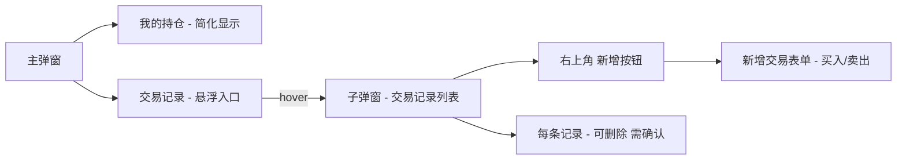

# 持仓模块重构计划

## 需求概述

将当前复杂的"持仓设置"编辑器重构为更清晰的两层结构：

- 主弹窗：简化的持仓摘要 + 交易记录入口
- 子弹窗：交易记录列表（支持新增/删除），持仓数据由交易记录自动计算

## 交互流程



## 涉及文件

| 文件                                                 | 改动类型                            |
| ---------------------------------------------------- | ----------------------------------- |
| `Sources/Models/PriceModels.swift`                   | 新增 TradeRecord，重构 PositionInfo |
| `Sources/Services/PriceHistoryManager.swift`         | 新增交易记录 CRUD                   |
| `Sources/Views/MenuItems/PositionMenuItemView.swift` | 大幅重构                            |
| `Sources/Views/StatusBarPopupView.swift`             | 新增交易记录行入口                  |
| `Sources/Controllers/StatusBarController.swift`      | 接入交易记录子弹窗                  |

## 详细步骤

### 1. 新增 TradeRecord 数据模型

在 `PriceModels.swift` 中新增：

```swift
enum TradeType: String, Codable, CaseIterable {
    case buy = "买入"
    case sell = "卖出"
}

struct TradeRecord: Codable, Equatable, Identifiable {
    var id: String          // UUID
    var type: TradeType     // 买入/卖出
    var price: Double       // 均价（元/克）
    var grams: Double       // 克数
    var fee: Double         // 手续费（元）
    var date: Date          // 交易时间
}
```

### 2. 重构 PositionInfo

PositionInfo 改为基于 `[TradeRecord]` 计算：

- `grams` = 所有买入克数之和 - 所有卖出克数之和
- `avgPrice` = 买入加权均价
- `totalFee` = 所有记录手续费之和
- `breakEvenPrice`（成本价）= (买入总成本 + 总手续费 - 卖出回收) / 剩余克数
- 保留 `sourceRawValue` 用于数据源选择
- 保留向后兼容的 Codable 解码（旧 Lot 数据自动迁移为 TradeRecord）

### 3. 更新 PriceHistoryManager

新增方法：

- `addTradeRecord(_ record: TradeRecord)`
- `deleteTradeRecord(id: String)`
- `tradeRecords: [TradeRecord]`（持久化存储）

保留 `savePosition` / `clearPosition` 但内部改为操作 TradeRecord 数组。

### 4. 简化主弹窗持仓行

当前 `PositionDisplayView` 显示：克数、均价/成本、收益金额、收益率

改为只显示 4 个关键指标：

- 持仓均价（买入加权均价）
- 成本价（含手续费的保本价）
- 克数（净持仓）
- 手续费（总手续费）

右侧仍保留收益显示。

### 5. 新增"交易记录"行

在 `StatusBarMainPanelView` 的 `positionRow` 下方新增一行"交易记录"，样式类似导航行，hover 时弹出子弹窗。

### 6. 重构子弹窗

替换当前的 `PositionEditorContent`（持仓设置表单）为新的交易记录列表视图：

子弹窗结构：

- 顶部：标题"交易记录" + 右上角"新增"按钮
- 中部：交易记录列表
  - 每条记录显示：类型标签（买入/卖出）、均价、克数、手续费、时间
  - 每条记录右侧有删除按钮
- 底部：数据源选择（保留 segmentedPicker）

### 7. 新增交易记录表单

点击"新增"按钮后，在列表顶部展开内联表单：

- 类型选择：买入 / 卖出（segmentedPicker）
- 均价输入
- 克数输入
- 手续费输入（元，直接输入金额）
- 时间选择（默认当前时间）
- 保存 / 取消按钮

### 8. 删除确认

删除交易记录时：

- 点击删除按钮 → 该行变为确认状态（显示"确认删除"和"取消"）
- 确认后删除并重新计算持仓

### 9. 数据迁移

在 `PositionInfo.init(from decoder:)` 中：

- 如果检测到旧格式（lots 数组），自动转换为 TradeRecord 数组
- 每个旧 Lot 转为一条 type=.buy 的 TradeRecord，fee 根据旧的全局手续费规则计算
- 迁移后保存新格式

### 10. 清理废弃代码

移除：

- `PositionLotDraft` 结构体
- `PositionEditorContent` 中的旧表单逻辑（买入明细、手续费规则区域）
- `PositionFeeMode` 枚举（手续费改为每笔直接输入金额）
- `lotRow`、`summaryCard`、`feeInputSection` 等旧视图方法
